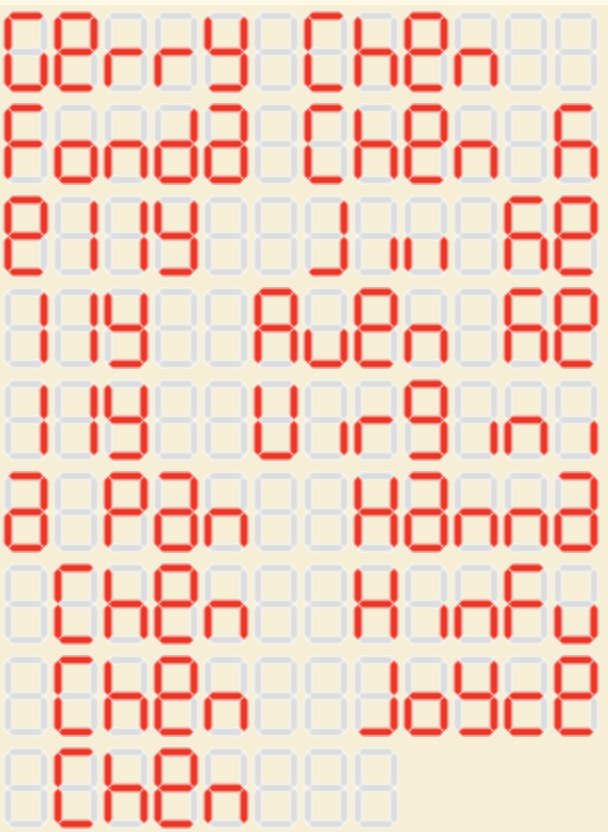

  

# Gerry's Custom Chip

This is a submission to Tiny Tapeout's 5th "shuttle" (like a group-buy for fabbing custom silicon chips).
It is one of 100 "tiles" that get fabbed on a 130nm process, so that way the cost of getting a chip fabbed can be shared among 100 people.  A mux selects your design out of the 100 that exist on the chip (that is, some of the pins are used to select which "tile" is yours so you just run yours and the transistors for every else's designs are not logically active).
If you're familiar with OSHpark, I interpret it as the OSHpark equivalent of custom silicon.  For just $100 to get a chip in your hand that you designed (part of), I'd say this is very well worth the price for such a cool souvenir!

I mainly created this because I think it would be a cool keepsake, and I have some pre-existing experience with Verilog so I wanted to see how difficult this type of process for creating custom silicon would be in the future if I ever wanted to do something more serious (e.g. with eFabless.com, $10k for your own order of 100 chips).

This design simply displays several names on a 7-segment display.  The names are hardcoded in the Verilog file, and the display cycles through them.  It is based on the template provided by Tiny Tapeout.

For more info on Tiny Tapeout, see the original README below.

---

# What is Tiny Tapeout?

TinyTapeout is an educational project that aims to make it easier and cheaper than ever to get your digital designs manufactured on a real chip.

To learn more and get started, visit https://tinytapeout.com.

## Verilog Projects

Edit the [info.yaml](info.yaml) and uncomment the `source_files` and `top_module` properties, and change the value of `language` to "Verilog". Add your Verilog files to the `src` folder, and list them in the `source_files` property.

The GitHub action will automatically build the ASIC files using [OpenLane](https://www.zerotoasiccourse.com/terminology/openlane/).

## How to enable the GitHub actions to build the ASIC files

Please see the instructions for:

- [Enabling GitHub Actions](https://tinytapeout.com/faq/#when-i-commit-my-change-the-gds-action-isnt-running)
- [Enabling GitHub Pages](https://tinytapeout.com/faq/#my-github-action-is-failing-on-the-pages-part)

## Resources

- [FAQ](https://tinytapeout.com/faq/)
- [Digital design lessons](https://tinytapeout.com/digital_design/)
- [Learn how semiconductors work](https://tinytapeout.com/siliwiz/)
- [Join the community](https://discord.gg/rPK2nSjxy8)

## What next?

- Submit your design to the next shuttle [on the website](https://tinytapeout.com/#submit-your-design). The closing date is **November 4th**.
- Edit this [README](README.md) and explain your design, how it works, and how to test it.
- Share your GDS on your social network of choice, tagging it #tinytapeout and linking Matt's profile:
  - LinkedIn [#tinytapeout](https://www.linkedin.com/search/results/content/?keywords=%23tinytapeout) [matt-venn](https://www.linkedin.com/in/matt-venn/)
  - Mastodon [#tinytapeout](https://chaos.social/tags/tinytapeout) [@matthewvenn](https://chaos.social/@matthewvenn)
  - Twitter [#tinytapeout](https://twitter.com/hashtag/tinytapeout?src=hashtag_click) [@matthewvenn](https://twitter.com/matthewvenn)
